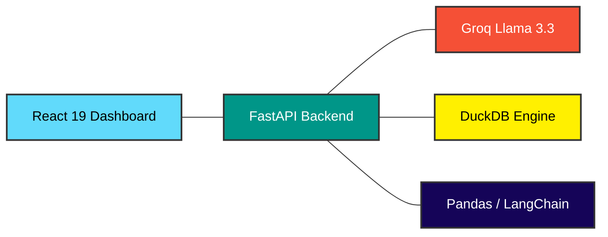

# DataMind BI: Advanced Conversational Data Analytics Platform

DataMind BI is an enterprise-grade conversational intelligence system that enables users to interact with structured databases using natural language. Built with a focus on self-healing logic and predictive discovery, this platform bridges the gap between complex analytical databases and human intuition.

## Core Value Proposition

Standard Business Intelligence tools often require specialized knowledge of SQL or drag-and-drop interfaces. DataMind BI eliminates this barrier by providing a fluid, chat-based interface that handles the heavy lifting of query generation, execution, and visualization.

---

## Technical Stack

I used a modern, high-performance stack to keep the data processing fast and the UI responsive.



* **Frontend**: React 19 (Vite), Tailwind CSS, Framer Motion, Recharts.
* **Backend**: FastAPI (Python), multi-threaded async execution.
* **Reasoning Engine**: Groq Llama 3.3 70B (Low-latency inference).
* **Analytical Engine**: DuckDB (In-memory analytical processing).
* **Data Orchestration**: LangChain, Pandas.

---

## Project in Action

Watch the full walkthrough of the system generating SQL and charts in real-time.

<div align="center">
  <a href="https://youtu.be/OA22fc28hpM">
    
  </a>
</div>

### Interface Showcase

<p align="center">
  
  
</p>
<p align="center">
  
  
</p>

---

## Technical Architecture

How the system processes natural language into data insights:

1. **Natural Language Processing**: The system receives a user query and performs acronym resolution and context mapping.
2. **Autonomous Query Synthesis**: The agent drafts optimized SQL queries targeted for a DuckDB analytical backend.
3. **Recursive Self-Correction**: If a query fails, the agent interprets the database error and automatically fixes the syntax before returning results.
4. **Contextual Suggestion Engine**: The system analyzes returned data to proactively suggest the next logical steps for data discovery.
5. **Interactive Visualization Layer**: Data is streamed to the frontend which dynamically renders interactive Recharts.

---

## Implementation Features

* **Self-Healing SQL**: Robust error handling that fixes syntax errors in real-time.
* **Predictive Discovery**: Generates 3 contextual follow-up questions after every response.
* **Hybrid Visuals**: Automatic selection between Bar, Line, and Pie charts based on data properties.
* **Data Storytelling**: Provides natural language summaries alongside raw tables.

---

## Deployment Guide

### Backend Configuration

1. Create a `.env` file in the `app/` directory:
```text
GROQ_API_KEY=your_api_key_here
```

2. Run the FastAPI server:
```powershell
# From the root directory
python app/api.py
```

### Frontend Configuration

1. Install dependencies:
```powershell
cd frontend
npm install
```

2. Start the development server:
```powershell
npm run dev
```

The platform will be accessible at http://localhost:5173.
