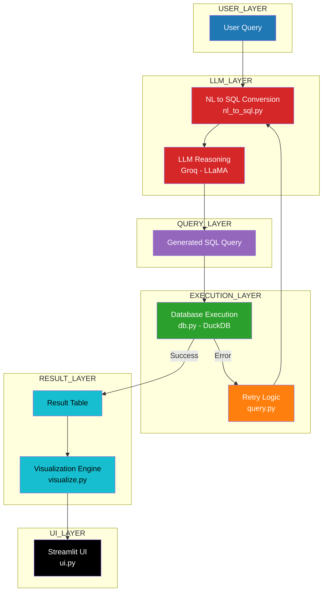
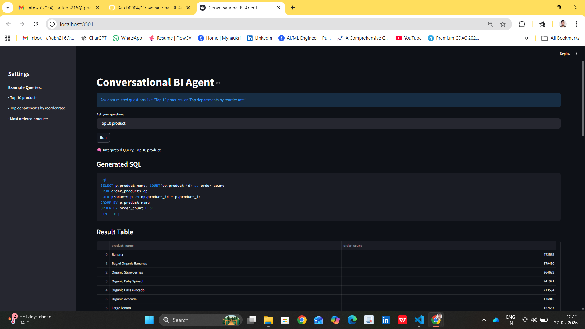

# Conversational BI Agent

An AI-powered Business Intelligence system that allows users to query structured data using natural language.
The system converts user queries into SQL, executes them on a database, and returns insights with automatic visualization.

---

## Features

- Natural Language to SQL conversion
- Automatic SQL error correction (retry logic)
- Conversational memory (follow-up queries)
- Automatic data visualization
- Fast query execution using DuckDB
- Streamlit-based interactive UI

---

## Problem Statement

Business users often need insights from data but do not know SQL.

Traditional BI tools require:
- Writing SQL queries
- Understanding database schemas
- Technical expertise

This system solves that by:
- Allowing users to ask questions in plain English
- Automatically generating SQL queries
- Returning results with visualizations

---

## Architecture Overview

## How to Run

### 1. Clone the repository

git clone https://github.com/Aftab0904/Conversational-BI-Agent.git
cd conversational-bi-agent  

---

### 2. Create virtual environment

python -m venv venv  
venv\Scripts\activate  

---

### 3. Install dependencies

pip install -r requirements.txt  

---

### 4. Setup environment variables

Create a `.env` file:

GROQ_API_KEY=your_api_key_here  

---

### 5. Run the application

streamlit run app/ui.py  

---

## Key Design Decisions

1. NL to SQL Approach  
Used LLM to convert natural language into SQL queries to make the system accessible to non-technical users.

2. Schema-aware Prompting  
Provided database schema to the LLM to avoid incorrect table generation.

3. Few-shot Prompting  
Used examples to improve SQL accuracy and reduce hallucinations.

4. Retry Logic  
If SQL execution fails, the system automatically corrects the query using the error message.

5. DuckDB Usage  
Used DuckDB as an in-memory analytical database for fast execution without setup.

6. Automatic Visualization  
Charts are generated based on result structure to improve interpretability.

7. Conversational Memory  
Follow-up queries are handled using session state.

---

## Limitations and Failure Modes

- SQL generation may fail for very complex queries
- Visualization logic is basic and may not always select the best chart
- Depends on LLM accuracy
- Schema changes require prompt updates

---

## Future Improvements

- Add advanced chart selection logic
- Support multi-database connections
- Add caching for faster repeated queries
- Improve SQL validation and optimization
- Add user authentication and dashboard saving

---

## Tech Stack

- Python  
- Streamlit  
- LangChain  
- DuckDB  
- Groq LLM  

---

## Dataset

Instacart Market Basket Analysis Dataset (Kaggle)

---

## Conclusion

This project demonstrates how AI can bridge the gap between business users and data by enabling natural language interaction with structured databases.

# Demo Conversational BI Agent

